# 初识**UART**串口与**DMA**的使用

> 我们主要用串口来进行单片机与单片机之间的通信，单片机与电脑之间的通信，单片机与外设之间的通信等等，那对于校初选来说，我们要做的应该就是 能让你的数据以一定格式显示在电脑上。后续对于打比赛来说应该是会用到UART调试，与上位机的通信，串口屏的使用等等。

### **UART的定义**

UART的全称是**`Universal Asynchronous Receiver/Transmitter`**是一种串行、异步、全双工的通信协议。

- `Universal`是**串行**的意思。串行通信是指利用一条传输线将数据一位位地顺序传送，区别于并行的8个数据位同时传输。

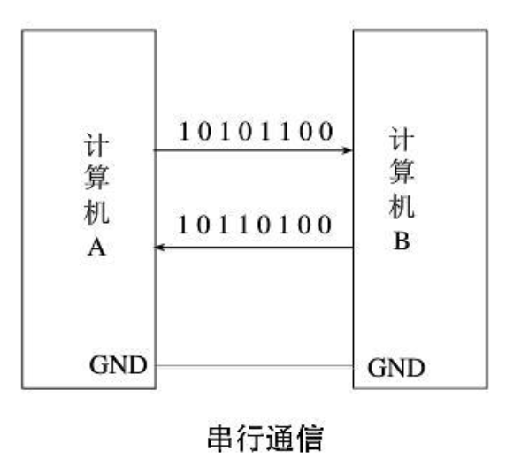

- `Asynchronous`是**异步**的意思 ，在异步通讯中，**不使用时钟信号**进行数据同步，它们直接在数据信号中穿插一些同步用的信号位，或者把主体数据进行打包，以数据帧的格式传输数据。例如规定由起始位、数据位、奇偶校验位、停止位等。
  某些通讯中还需要双方约定数据的传输速率，以便更好地同步 。波特率(bps)是衡量数据传送速率的指标。     

  

​	由于*没有时钟信号作为参考*，**UART**通信双方需要约定一个特定的传输速率，这个传输速率就是**波特率**。	

​	**波特率**（Baud Rate） 是指串行通信中每秒传输的符号（Symbol）数，单位为 Baud（波特），常见的有4800、9600、115200等。

​	1 Baud = 1 Symbol/s（每秒1个符号）。符号（Symbol） 常用来表示一个二进制位（bit）

​	在UART通信中波特率是核心参数，决定了传输的速度，波特率由硬件定时器生成，公式通常为：
$$
波特率 = \frac{系统时钟频率}{分频系数}
$$
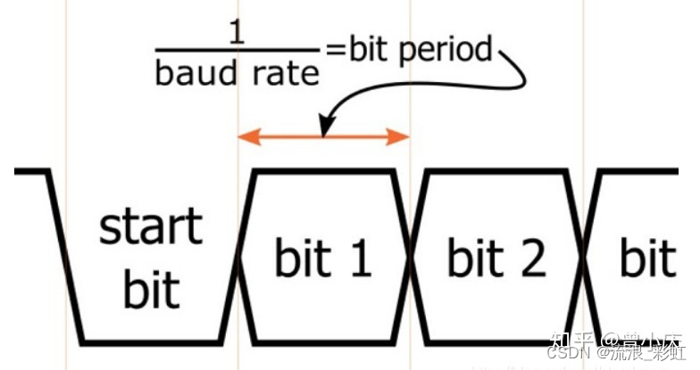

​	==一定要记得根据你使用的东西更改相应波特率==，不然就全是乱码了，~~*不要问我怎么知道的*~~。

​	在固定了传输速率后，我们就可以考虑怎么解析传输过来的信息了

​	我们用于传输信号的数据线在默认情况下处于高电平，为了让对方知道什么时候开始通信，UART采用拉低电平的方式标志起始位。在	发完8位数据后还带有奇偶校验位，停止位等，由此来完成一个通信过程。


- `Receiver/Transmitter` 即表示可以**发送和接收**，这个没有什么好说的。

  

附上一张通信方式分类的图，大家可以自己额外研究研究每个通信方式的特点

*~~本来笔试题我是负责出这部分的题目的，后来因为题目太多我出的这部分的都被删了(ㄒoㄒ)~~*


### **UART实战**

在**UART**通信中，我们有三种主流的使用方式，即**轮询方式**，**中断方式**以及**空闲中断加+DMA方式**

首先我们要新建一个cubemx加Keil的工程，一开始的基础配置相信大家都已经熟练掌握了吧~~（应该吧）~~，（调试口，晶振，时钟树，每个外设生成.c/.h文件）

不过这次我们要开的外设是UART这个外设

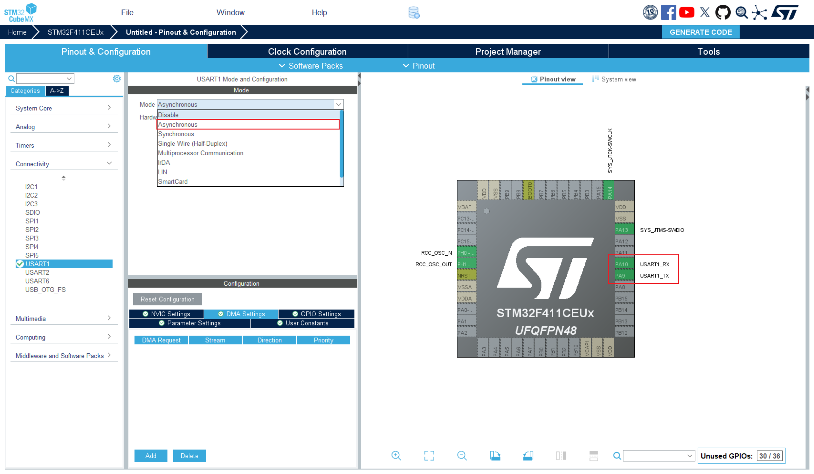

注意这里的`TX`是**发送端**，`RX`是**接收端**，`TX`应该发送给别的外设的`RX`，所以说在接线的时候单片机与另一个的串口的`RX`与`TX`**==反接==**！**==反接==**！**==反接==**！

以及共地用来使电平参考一致   	 **==共地==**！**==共地==**！**==共地==**！


`GENERATE` `CODE`之后我们就可以开始编程了。

#### 串口调试助手

但是，在编程之前，为了查看我们串口的效果，需要在电脑上显示出我们串口的内容，我们需要下载一个串口调试的软件叫做`VOFA+`，安装包在压缩包中

接下来介绍我们的串口代码

#### 轮询方式（阻塞方式）

> 原理：轮询方式下CPU会不断读取串口寄存器状态。发送数据时，当检测到发送数据寄存器TDR有数据时，调用HAL_UART_Transmit发送数据。接收数据时，当检测到接收寄存器RDR有数据时，调用HAL_UART_Receive接收数据。
>
> 缺点：CPU需要不断扫描寄存器状态，在一定程度上加重了CPU的负担，不适用于对系统精度较高的场所

##### 发送数据

```C
/**
  * @brief  在轮询方式下发送一定数量的数据
  * @note   1. 该函数连续发送数据，发送过程中通过判断TXE标志来发送下一个数据，通过判断TC标志来结束数据的发送。
  *         2. 如果在等待时间内没有完成发送，则不再发送，返回超时标志
  * @param huart   UART handle.
  * @param pData   指向发送数据缓冲区的指针 (u8 or u16 data elements).
  * @param Size    待发送数据的个数(u8 or u16)
  * @param Timeout 超时等待时间
  * @retval HAL status
  */
HAL_StatusTypeDef HAL_UART_Transmit(UART_HandleTypeDef *huart, uint8_t *pData, uint16_t Size, uint32_t Timeout)
    
```

- `huart`指向当前所用的`uart`的句柄

- `pData`是要发送的数据

- `Size`是数据的大小

- `Timeout`是等待数据传输时间

在代码中我们先定义一个需要传输的数组`message[]`

```c
/* USER CODE BEGIN PV */
char message[] = "Hello World\n";
/* USER CODE END PV */
```

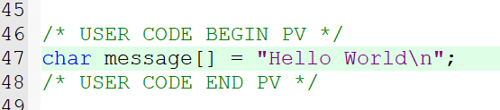

然后在while循环中将其以1s时间间隔发送

```c
  /* USER CODE BEGIN WHILE */
  while (1)
  {
		HAL_UART_Transmit(&huart1,(uint8_t *)message,13,100);
		HAL_Delay(1000);
    /* USER CODE END WHILE */

    /* USER CODE BEGIN 3 */
  }
  /* USER CODE END 3 */
```

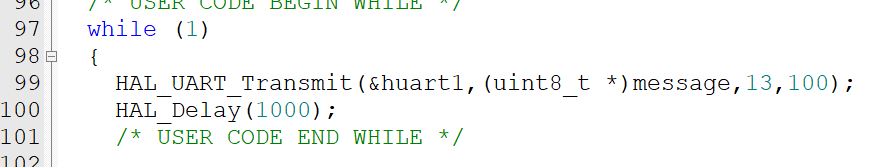

在`VOFA`中选择对应的端口号打开就可以看见发送的数据了


##### 接收数据

```C
/**
  * @brief  在轮询方式下接收一定数量的数据
  * @note   1. 该函数连续接收数据，在接收过程中通过判断RXNE标志来接收新的数据
  *         2.如果在等待时间内没有完成接收，则不再接收，返回超时标志
  * @param huart   UART handle.
  * @param pData   指向接收数据缓冲区的指针(u8 or u16 data elements).
  * @param Size    待接收数据的个数 (u8 or u16)
  * @param Timeout 超时等待时间
  * @retval HAL status
  */
HAL_StatusTypeDef HAL_UART_Receive(UART_HandleTypeDef *huart, uint8_t *pData, uint16_t Size, uint32_t Timeout)
    
```

参数类似于上面的

接下来我们看看接收函数的效果

```C
/* USER CODE BEGIN PV */
// 定义接收数组
uint8_t rx_buf;
/* USER CODE END PV */
```

```C
  /* USER CODE BEGIN WHILE */
  while (1)
  {
		//接收数据
		HAL_UART_Receive(&huart1,&rx_buf,sizeof(rx_buf),HAL_MAX_DELAY);
		// 把接收到的数据回发
		HAL_UART_Transmit(&huart1,&rx_buf,sizeof(rx_buf),HAL_MAX_DELAY);
    /* USER CODE END WHILE */

    /* USER CODE BEGIN 3 */
  }
  /* USER CODE END 3 */
```

实现效果如下：

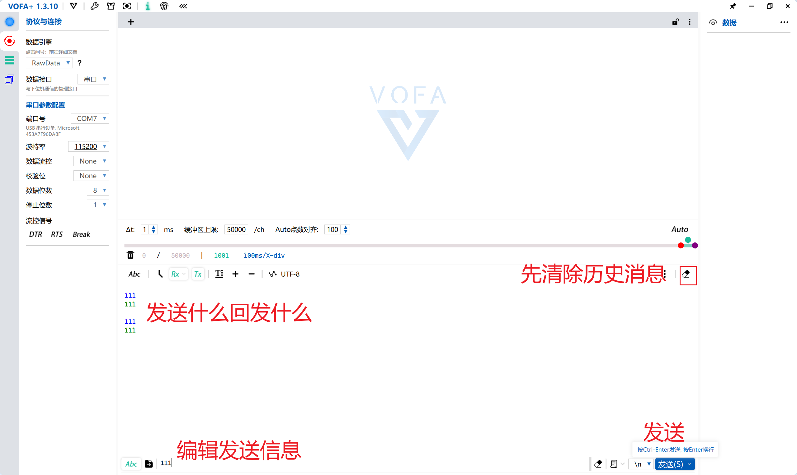

#### 中断方式

上面的这种方式会使程序阻塞在while循环中的``HAL_UART_Receive(&huart1,&rx_buf,sizeof(rx_buf),HAL_MAX_DELAY);``这条语句中，这很显然是我们不愿意看到的，因此我们可以采用中断的方法，让cpu先去处理别的函数，等到接收到数据，触发中断再回来处理接收到的数据，这种模式就叫做中断模式。

> 原理：中断就是在寄存器有一个字节数据的时候触发一次中断，而不用一直扫描寄存器状态，节约了系统资源。例如串口接收24字节数据，HAL_UART_Receive_IT(&huart1, (uint8_t *)&Rx, 1) 意思就是每来一个字节数据中断一次，中断之后就进入回调函数进行处理，此时Rx是一个uint8_t的字节数据。HAL_UART_Receive(&huart1, (uint8_t *)Rx, 24)意思是没来一个字节数据中断一次，等接收到24个字节数据之后再统一进入回调函数之后进行处理，此时Rx是一个uint8_t的数组字节数据。
>
> 缺点：虽然解决了轮询不断扫描寄存器状态的缺点，但CPU接收数据会触发中断，对于实时要求高的场所，不适用。

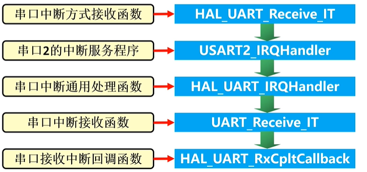

##### 发送数据

```C
/**
  * @brief  在中断方式下发送一定数量的数据
  * @param huart UART handle.
  * @param pData 指向发送数据缓冲区的指针 (u8 or u16 data elements).
  * @param Size  待发送数据的个数(u8 or u16)
  * @retval HAL status
  */
HAL_StatusTypeDef HAL_UART_Transmit_IT(UART_HandleTypeDef *huart, uint8_t *pData, uint16_t Size)
    
```

##### 接收数据

```C
/**
  * @brief  在中断方式下接收一定数量的数据
  * @param huart UART handle.
  * @param pData 指向接收数据缓冲区的指针 (u8 or u16 data elements).
  * @param Size  待接收数据的个数(u8 or u16)
  * @retval HAL status
  */
HAL_StatusTypeDef HAL_UART_Receive_IT(UART_HandleTypeDef *huart, uint8_t *pData, uint16_t Size)

```

接下来看看怎么实现

首先在cubemx中我们需要将中断开启

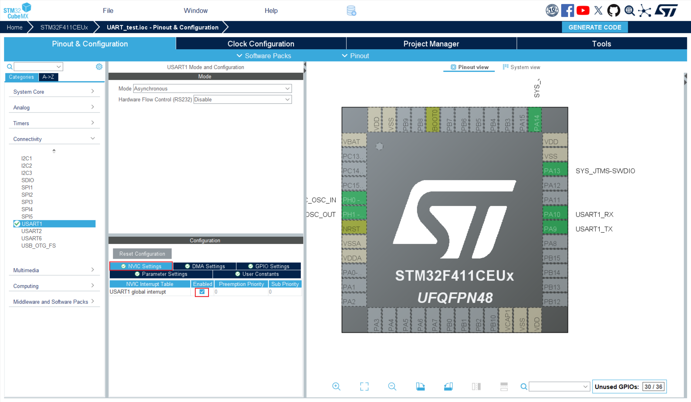

重新`GENERATE CODE`应用修改就可以改写我们的代码了

其实改成中断的方式很简单，只需要在原来的语句后面加上`_IT`，再加一个中断回调函数就好了。

我们先定义一个宏定义大小

```C
/* USER CODE BEGIN PD */
#define DATA_LEN 255
/* USER CODE END PD */
```

定义接收数组

```C
/* USER CODE BEGIN PV */
uint8_t rxData[DATA_LEN];
/* USER CODE END PV */
```

开启接收

```C
  /* USER CODE BEGIN 2 */
	HAL_UARTEx_ReceiveToIdle_IT(&huart1,rxData,sizeof(rxData));
  /* USER CODE END 2 */
```

重定义中断回调函数

```C
/* USER CODE BEGIN 4 */
void HAL_UARTEx_RxEventCallback(UART_HandleTypeDef *huart,uint16_t Size){

	if (huart ->Instance == USART1){
		HAL_UART_Transmit(&huart1, rxData, sizeof(rxData),100);
		
		HAL_UARTEx_ReceiveToIdle_IT(&huart1,rxData,sizeof(rxData));
		memset(rxData,0,sizeof(rxData));
	}
}
/* USER CODE END 4 */
```

我们就可以实现以下效果，和上面的一样

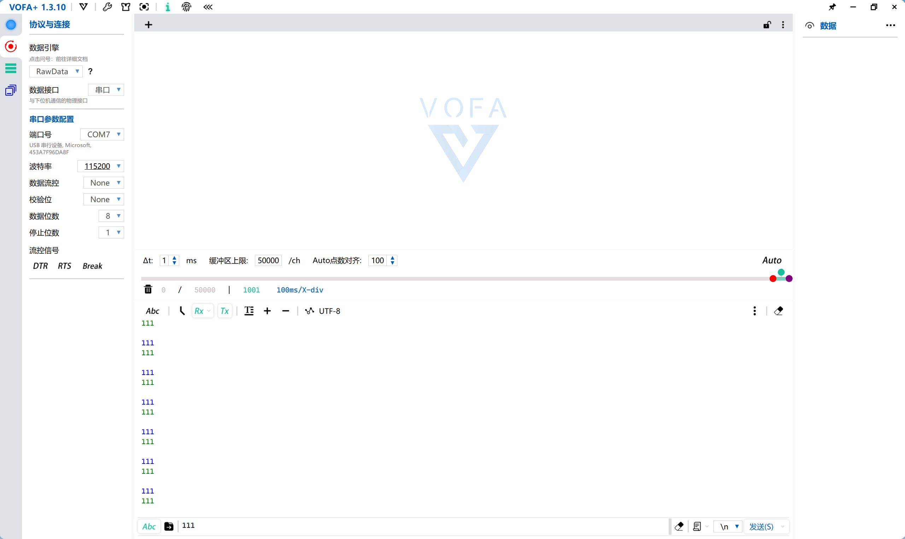

### **DMA**

在了解空闲中断加+DMA方式方式之前，我们有必要先知道一下什么是`DMA`

`DMA`，全称`Direct Memory Access`，即直接存储器访问。

`DMA`传输将数据从一个地址空间复制到另一个地址空间，提供在外设和存储器之间或者存储器和存储器之间的高速数据传输，**无须CPU干预**，节省了CPU的资源。


如果没有不通过DMA，CPU传输数据还要以内核作为中转站，例如将ADC采集的数据转移到目标位置中。

而如果通过DMA的话，DMA控制器将获取到的外设数据存储到DMA通道中，然后通过DMA总线与DMA总线矩阵协调，将数据传输到目标位置中，期间不需内核参与。

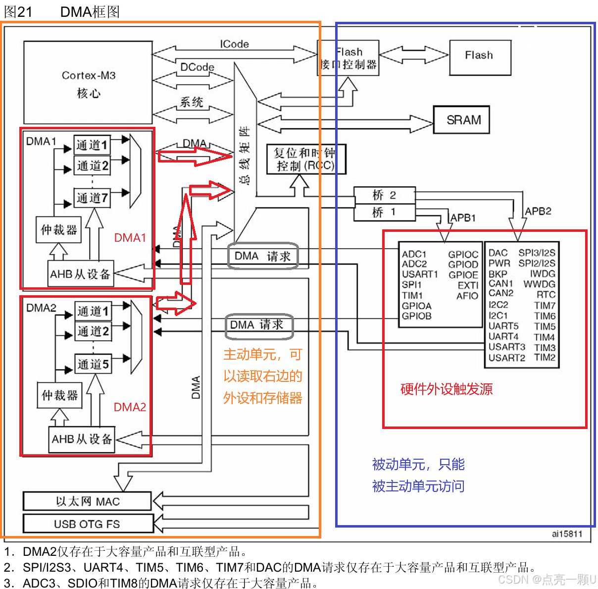

但是这张图不需要看懂，你只需要知道DMA可以不经过CPU直接传输数据就行。

> （这些其实也不用看）
>
> 主要特征：
>
> 同一个DMA模块上，多个请求间的优先权可以通过软件编程设置（共有四级：很高、高、中等和低），优先权设置相等时由硬件决定（请求0优先于请求1，依此类推）；
> 独立数据源和目标数据区的传输宽度（字节、半字、全字）；
> 可编程的数据传输数目：最大为65535；
> 对于大容量的STM32芯片有2个DMA控制器 两个DMA控制器，DMA1有7个通道，DMA2有5个通道.

#### 空闲中断加+DMA方式

> 原理：为了避免上述两种情况给CPU带来的压力，利用DMA对数据进行处理。当寄存器接收到完整数据时候才会开启一次中断，然后进行DMA转运数据，DMA是独立于CPU外的直接存储器访问设备，可以减轻CPU压力。

##### 发送数据

```C
HAL_StatusTypeDef HAL_UART_Transmit_DMA(UART_HandleTypeDef *huart, const uint8_t *pData, uint16_t Size);
```

##### 接收数据

```C
HAL_StatusTypeDef HAL_UARTEx_ReceiveToIdle_DMA(UART_HandleTypeDef *huart, uint8_t *pData, uint16_t Size)
```

首先依旧是cubemx的配置

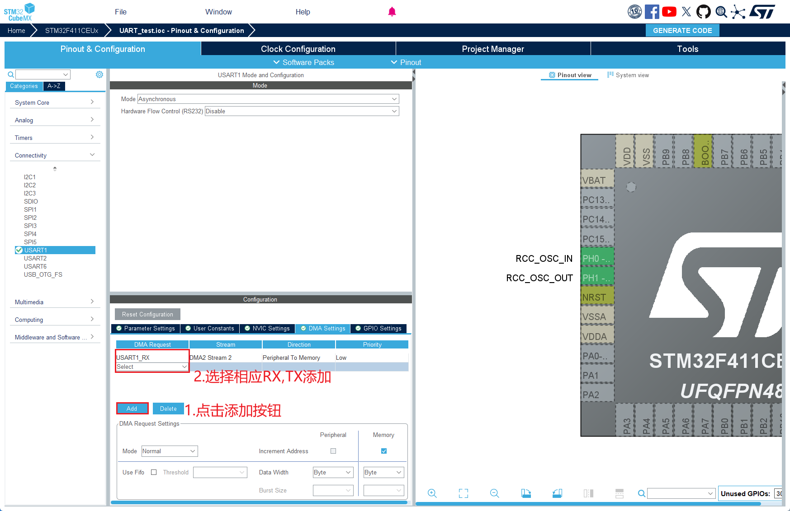

现在我们可以开始编写我们的DMA模式的串口代码了

改DMA就更简单了，只要改改后缀就行

首先定义接收数组和上面的定义一样

然后修改开启

```C
  /* USER CODE BEGIN 2 */

	HAL_UARTEx_ReceiveToIdle_DMA(&huart1, rxData, sizeof(rxData));
	// 关闭DMA过半中断
	__HAL_DMA_DISABLE_IT(&hdma_usart1_rx, DMA_IT_HT);
	
  /* USER CODE END 2 */
```

修改中断函数

```C
void HAL_UARTEx_RxEventCallback(UART_HandleTypeDef *huart, uint16_t Size)
{
	if(huart->Instance == USART1)
	{
		HAL_UART_Transmit(&huart1, rxData, sizeof(rxData),100);
		HAL_UARTEx_ReceiveToIdle_DMA(&huart1,rxData, sizeof(rxData));
		__HAL_DMA_DISABLE_IT(&hdma_usart1_rx, DMA_IT_HT);
	}
}
```

这个时候有个地方会报错，只要把操作句柄拿过来就行了

```C
/* USER CODE BEGIN PV */
extern DMA_HandleTypeDef hdma_usart1_rx;
/* USER CODE END PV */
```

最后看到的效果和上面是一样的。

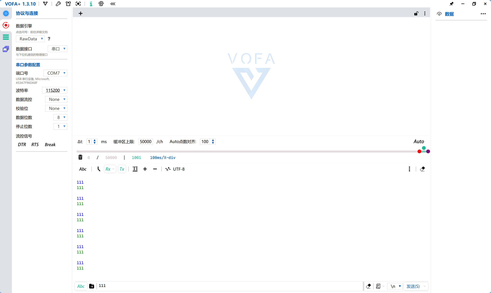

大概到这里就结束了，希望大家认真预习捏(～￣▽￣)～

附上一张他自己生成的思维导图，没什么用，水点字数


### 重定向

在PC上进行C语言程序开发时，我们可以利用C语言的格式化输出函数 printf()将程序的运行结果发送到显示屏上显示，也可以利用格式化输人函数 scanf()读取由键盘输入的信息。在嵌入式系统的开发中，我们也希望能够将程序的运行结果或者调试信息发送到 PC 上显示，并读取由键盘输入的信息，实现良好的人机交互。

HAL库提供的串口收发函数，功能比较简单，不能进行格式化的输入输出。如果要实现类似 C语言中的格式化输入输出函数，需要把printf()函数的输出和 scanf( )函数的输入重新定向到串口。

具体的实现方法如下：用户编写与C 语言标准库函数中同名的函数，当链接器检查到用户编写了与标准库函数同名的函数时，将优先使用用户编写的函数，从而实现对标准库函数的间接修改(标准库函数中的同名函数采用了 weak 属性定义)。

由于printf()函数通过调用fputc()函数来实现数据的输出，scanf()函数通过调用fgetc()函数来实现数据的输入，因此用户需要改写这两个函数来实现串口的重定向。

在进行重定向之前，需要配置好串口，使用到串口的轮寻模式。

> 注意：由于 printf()函数和scan()函数是由MDK 软件所提供的 C语言标准库函数，在完成程序编写后，用户还需要在MDK 软件的工程设置窗口中选择“Target”标签页勾选其中的“Use MicroLIB”选项。如果不勾选“Use MicroLIB”选项，则无法使用。


第一步：由于主程序中调用了printf()函数和scanf()函数，因此需要添加标准输入输出头文件：stdio.h。

```c
/* USER CODE BEGIN Includes*/

#include <stdio.h>// 包含标准输入输出头文件

/* USER CODE END Includes*/
```

第二步：重写fputc()函数

```C

int fputc(int ch,FILE *f)
{
	//采用轮询方式发送1字节数据，超时时间设置为无限等待
	HAL_UART_Transmit(&huart1,(uint8_t *)&ch,1,HAL_MAX_DELAY);
	return ch;
}
```

注意：由于入口参数ch是整型变量，而函数HAL_UART_Transmit()的入口参数pdata是指向无符号字符型的指针，因此需要进行强制类型转换，将int转换为uint8_t*。

HAL_MAX_DELAY意味着无限等待，可以修改，比如修改为1000。

第三步：重写fgetc()函数

```C
int fgetc(FILE *f)
{
	uint8_t ch;
	// 采用轮询方式接收 1字节数据，超时时间设置为无限等待
	HAL_UART_Receive(&huart1,(uint8_t*)&ch,1, HAL_MAX_DELAY );
	return ch;
}
```

注意：调用scanf()函数读取串口数据时，需要以空格作为输入的结束。因此在串口调试助手中输入数据时，必须以空格作为结束，然后再点击发送按钮，否则无法正确接收数据。

scanf()函数只能接收不带空格的字符串。如果用户需要接收一个带空格的字符串，需要先逐个字节的接收，在接收过程中通过不断判断是否接收到 ‘\r’和‘\n’两个字符，来确定字符串是否接收完成。此时，串口调试助手的发送区中应该在输入一个完整字符串后，再按下键盘的“ENTER”键作为结束


参考文献：

比较重要：

[UART通信协议及其工作原理（图文并茂+超详细）-CSDN博客](https://blog.csdn.net/weixin_39939185/article/details/134657483)

[通信方式的分类（串行通信和并行通信）-CSDN博客](https://blog.csdn.net/Rocher_22/article/details/116590629)

[【STM32】DMA超详细解析·入门级教程_dma教程-CSDN博客](https://blog.csdn.net/MANONGDKY/article/details/154383583?ops_request_misc=&request_id=&biz_id=102&utm_term=DMA入门&utm_medium=distribute.pc_search_result.none-task-blog-2~all~sobaiduweb~default-1-154383583.142^v102^pc_search_result_base2&spm=1018.2226.3001.4187)（这个里面对DMA讲的非常详细，一开始可能看不懂）

不是很重要（选看）：

[基于STM32HAL库的三种串口接收方式_stm32 hal 串口接收-CSDN博客](https://blog.csdn.net/qq_44758496/article/details/132206223)

[STM32 HAL库 UART串口发送数据实验_stm32 hal 串口发送-CSDN博客](https://blog.csdn.net/ElePower9527/article/details/145631460)

[【STM32】CUBEMX之串口：串口三种模式（轮询模式、中断模式、DMA模式）的配置与使用示例 + 串口重定向 + 使用HAL扩展函数实现不定长数据接收_cubemx配置串口-CSDN博客](https://blog.csdn.net/Rick0725/article/details/136576310)

[【STM32HAL库】串口通信-UART_stm32 hal uart-CSDN博客](https://blog.csdn.net/2301_79330491/article/details/138000201)
